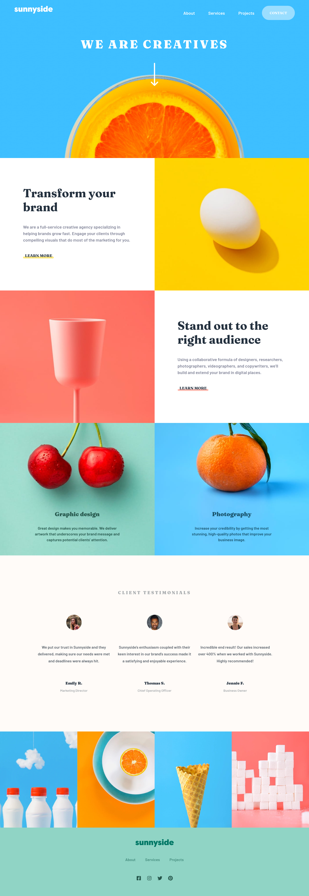

# Frontend Mentor - Sunnyside agency landing page solution

This is a solution to the [Sunnyside agency landing page challenge on Frontend Mentor](https://www.frontendmentor.io/challenges/sunnyside-agency-landing-page-7yVs3B6ef). Frontend Mentor challenges help you improve your coding skills by building realistic projects.

## Table of contents

- [Overview](#overview)
  - [The challenge](#the-challenge)
  - [Screenshot](#screenshot)
  - [Links](#links)
- [My process](#my-process)
  - [Built with](#built-with)
- [Author](#author)

**Note: Delete this note and update the table of contents based on what sections you keep.**

## Overview

### The challenge

Users should be able to:

- View the optimal layout for the site depending on their device's screen size
- See hover states for all interactive elements on the page

### Screenshot

### Links

- Solution URL: [https://github.com/donosti1/fm-sunnyside-agency-landing-page](https://github.com/donosti1/fm-sunnyside-agency-landing-page)
- Live Site URL: [https://fm-sunnyside-agency-landing-page-donosti1.vercel.app/](https://fm-sunnyside-agency-landing-page-donosti1.vercel.app/)

## My process

### Built with

- CSS Grids
- Mobile First
- [React](https://reactjs.org/) - JS library
- [Chakra UI](https://chakra-ui.com/) - React Component library

## Author

- Frontend Mentor - [@donosti1](https://www.frontendmentor.io/profile/donosti1)
- Github - [@donosti1](https://github.com/donosti1)
